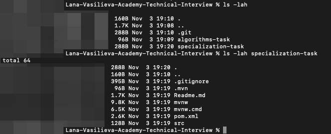
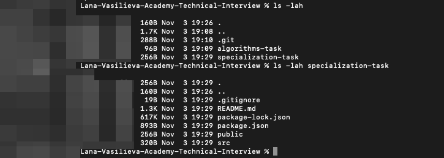

# Syberry Academy Technical Interview: Requirements

### Before you start
You must create a **private** repository named `Name-Surname-Academy-Technical-Interview` and add `SyberryAcademy` as Collaborator. <br>
Your repository must have the following structure: <br>

```
README.md
algorithms-task
  solution.[extension]
specialization-task
  the content of a git folder
```

**There must be two folders in your repository:** <br>
_(It doesn't matter if you have completed one or two tasks)_

1. `algorithms-task` - this is the directory with the algorithms-task solution
2. `specialization-task` - this is the directory with the corresponding solution to the problem, depending on the programming language.

**To create this structure, follow these steps:**
1. Create a project
2. Initialize your git repository in the project root: `git init`
3. Create the `algorithms-task` directory: `mkdir algorithms-task`
4. Copy the task from the git repository to the `specialization-task` directory:
``` 
git clone <link to the git task> specialization-task
```
5. Go to directory `specialization-task` and delete the folder` .git`, this folder may be hidden:
```
cd specialization-task
rm -rf .git
```

After completing these steps your folders will look like this: <br>
Java Example: <br>
 <br>

JS Example: <br>
 <br>

You are ready for the technical interview!

Note 1: <br>
You may need to add a remote repository for your project, you can use the following command:
`git remote add origin <link to your repository>`

Note 2: <br>
To the algorithms-task folder add `solution.[extension]` file. This file must contain the solution to the given task. Please note: your file `MUST` contain a `solution()` function. You may write as many functions as you want to solve the task, but we will check only this function. If the `solution()` function does not work, your task is considered as failed. <br>

Note 3: <br>
Please be careful with pushing to `specialization-task` folder. Don't push into our repository! To avoid this, delete `.git` folder from `specialization-task` folder.<br>

### How to Submit
Your last commit must have a comment 'Final commit' and must be no later than 2h 30minutes after interview starts.

Please send us an email when finished (to s.vasilieva@syberry.com).

We promise to grade your solution within 5 working days starting the day of your interview.
